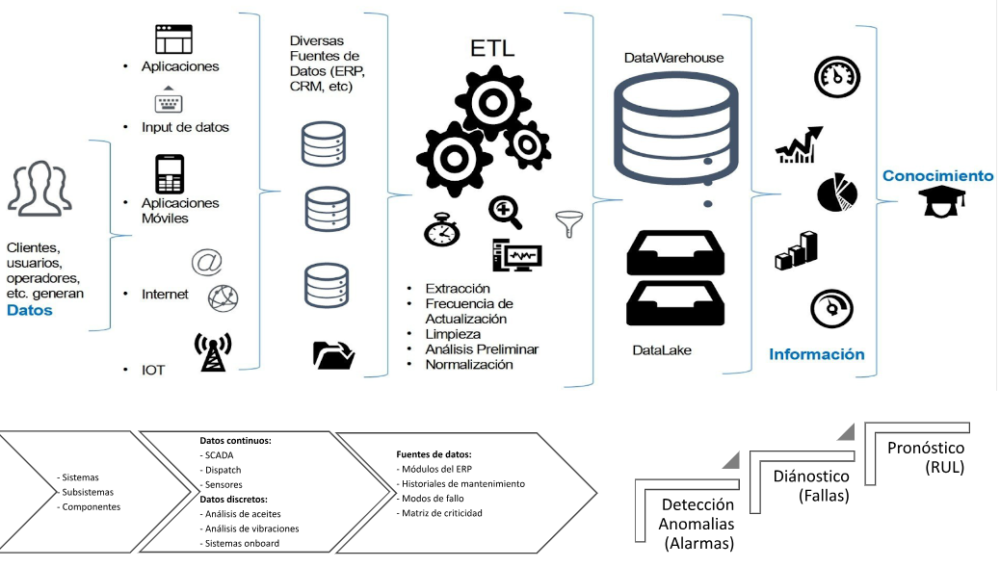

# Mantenimiento Predictivo

El mantenimiento predictivo, en pocas palabras, consiste en determinar cuándo se debe mantener un activo y qué actividades de mantenimiento específicas deben realizarse, en función de la condición o estado real de un activo, en lugar de en un cronograma fijo, para que pueda maximizar tiempo de actividad y productividad. Se trata de predecir y prevenir fallas y realizar las rutinas de mantenimiento adecuadas para reducir los costosos tiempos de inactividad de los equipos.

Con IoT y la transmisión de datos de sensores desde los equipos, el mantenimiento predictivo permite a los fabricantes predecir de manera efectiva las interrupciones de las máquinas. Los datos detectan variaciones, comprenden las señales de advertencia e identifican cualquier patrón que pueda indicar una posible falla. Los fabricantes pueden utilizar análisis y aprendizaje automático para predecir con precisión las probabilidades de que una máquina falle. Esto permite planificar medidas correctivas tempranas (es decir, pedido de repuestos, programación de reparaciones, etc.) e introducirlas de la manera más efectiva, evitando así tiempos de inactividad no planificados y personal y recursos costosos.

El mantenimiento predictivo forma parte de la filosofía del mantenimiento basado en la condición.
Pero va más allá: determina intervenciones para las máquinas, con base en ciertos indicadores. Comúnmente, se evalúan factores como la vibración, termografía y otros.
Los principales objetivos del mantenimiento predictivo son:
- Determinar -de antemano- la necesidad de servicios de mantenimiento.
- Eliminar el desmontaje innecesario, para la inspección.
- Aumentar el tiempo de actividad del equipo.

Esta metodología también tiene como prioridad:
- Disminuir el mantenimiento de emergencia no planificado.
- Prevenir daños mayores.
- Maximizar la vida útil de los componentes.

De esta forma, el mantenimiento predictivo aumenta el grado de confianza en el desempeño de los equipos y determina con anticipación las interrupciones de fabricación.

Como usamos Machine Learning:
- Prevención de fallas: se entrena un modelo para que pueda predecir una falla antes de que suceda, evitando roturas consecuentes y mejorando la programación del mantenimiento.
- Reducción de mantenimiento preventivo: al basarse en la condición de la máquina, nos permite prolongar los mantenimientos preventivos, lo cual reduce costos y tiempo sin producir
- Clasificación de fallas: en caso de que una falla suceda, podemos clasificarla y agilizar la reparación.

