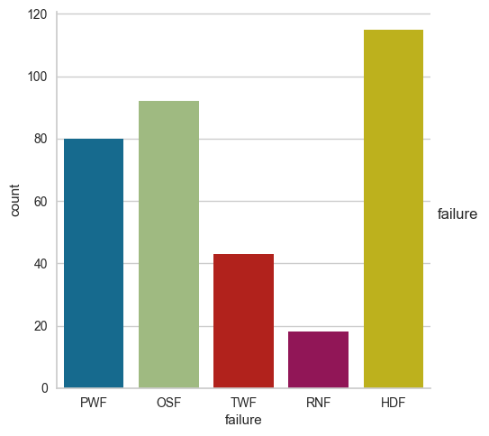
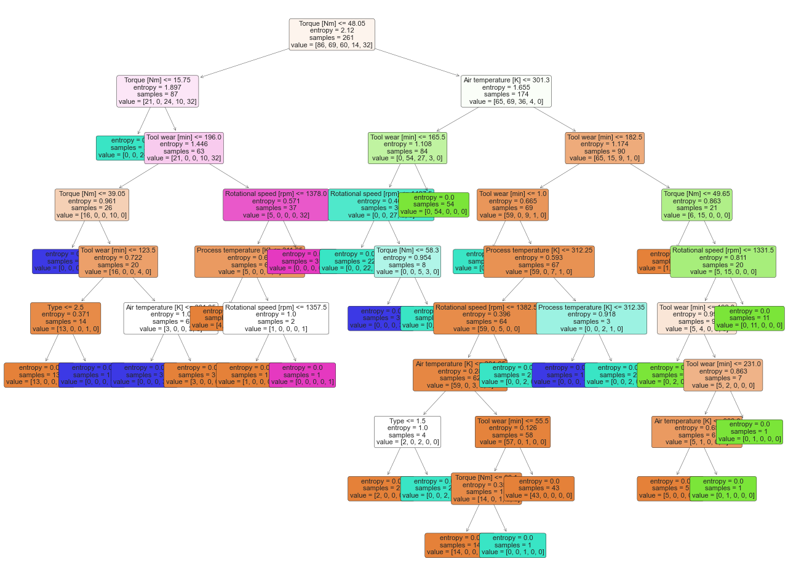
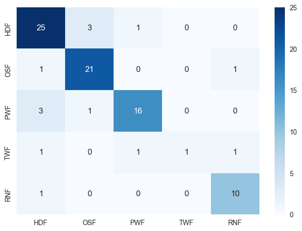

# Mantenimiento Predictivo

### En el primer ejemplo tomamos la data de unas fresadoras, y analizamos sus fallas.

- **TWF (Desgaste herramienta)**

- **HDF (Problema de refrigeración)**

- **PWF (Problema de energía)**

- **OSF (Sobreexigencia)**

- **RNF (Otras)**

### Luego de analizar la distribución de las fallas generamos modelos de Machine Learning, 

### Y por último usuamos el modelo para clasificar el tipo de falla

