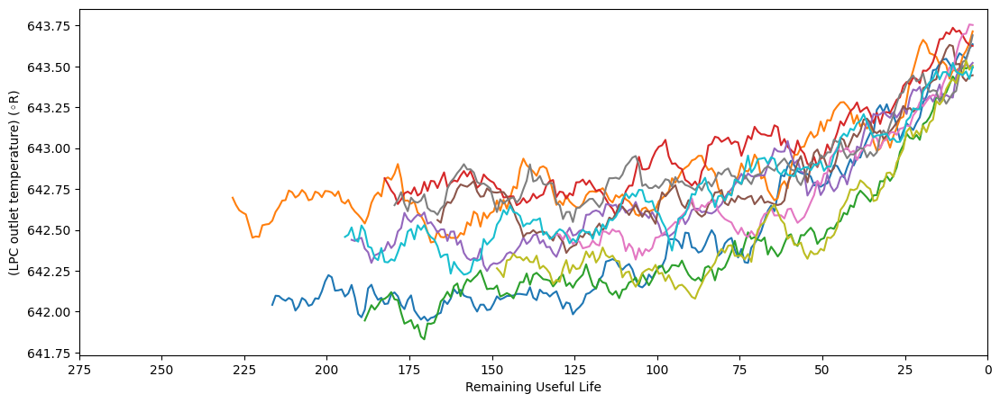

# Predicción de vida útil de Turbinas

### En este ejemplo analizamos data de turbinas, para ver la vida útil de cada una y el cambio en las mediciones de los sensores a medida que acumulan ciclos de uso.

## Luego de analizar la data generamos modelos de Machine Learning y podemos predecir la vida útil restantes de las turbinas.

## Por útimo aplicamos otro modelo de clasificación, para saber si una turbina está en buen estado, de riesgo medio o de riesgo alto.

